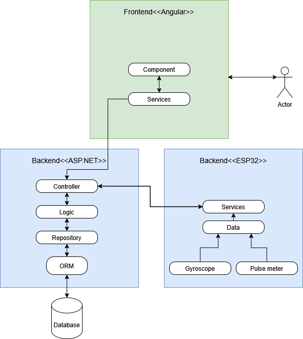
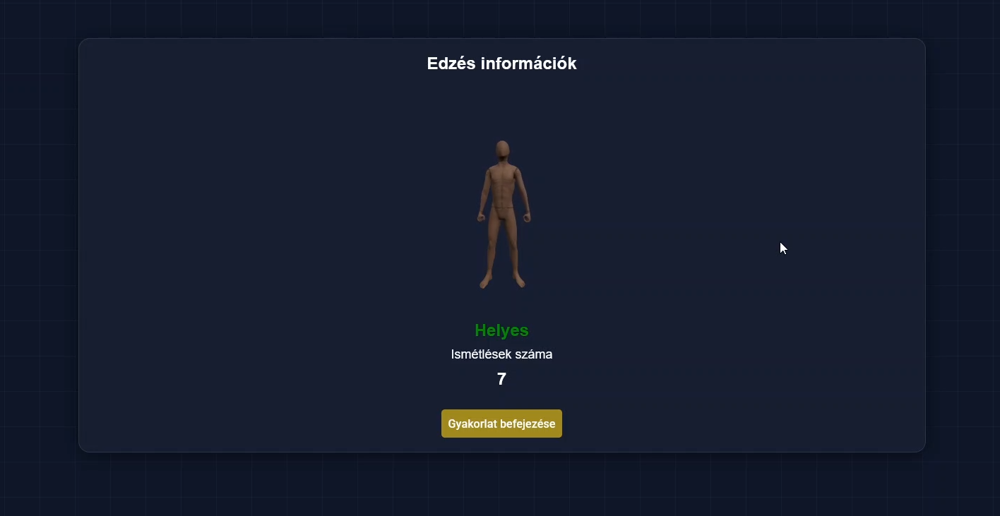
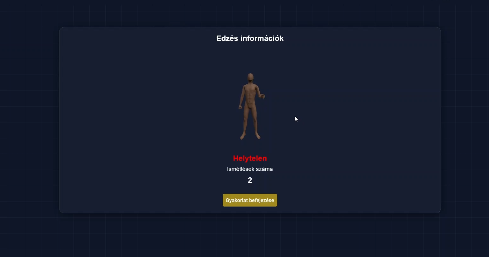
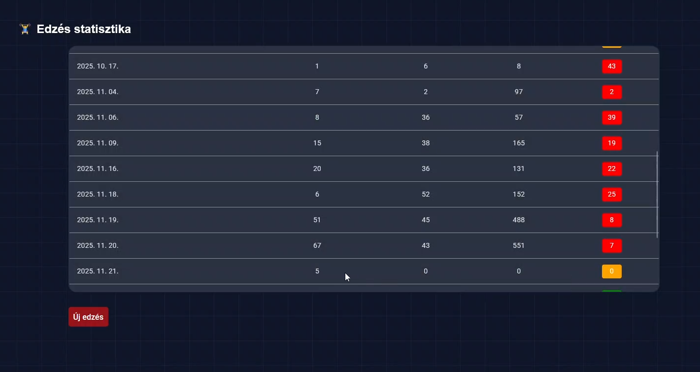

# 🏋️ AI-Powered Workout Optimization

An IoT-based full-stack application designed to analyze gym exercise form in real-time using Deep Learning (LSTM) and monitor cardiovascular health.


## 📖 Overview

This project bridges the gap between hardware sensors and AI analysis to help users exercise correctly.

The system consists of a wearable **ESP32 device** that streams sensor data to a **.NET backend**. The server processes this data through a pre-trained **LSTM Neural Network** to evaluate movement patterns (e.g., detecting if an exercise is performed with correct form) and broadcasts real-time feedback to an **Angular Dashboard**.

---

## 🏗️ System Architecture

<p align="center">
  
</p>

The application follows a secure, **Event-Driven Architecture** to handle real-time data efficiently.

### 1. IoT / Edge Layer (C++ & PlatformIO)
* **Hardware:** ESP32 Microcontroller + MPU6050 (IMU) + Pulse Sensor.
* **Communication:** Uses **WebSockets** for low-latency, continuous data streaming to the server.
* **Role:** Captures raw kinematic data and sends it for processing.

### 2. Backend Layer (C# & ASP.NET Core 8)
* **API Security:** RESTful endpoints protected by **JWT (JSON Web Token)** authentication.
* **Real-time Logic:** Manages WebSocket streams from the device and uses **SignalR** to push updates to the frontend instantly.
* **AI Inference:** Integrates a Python-trained **LSTM model** to classify movements on-the-fly.
* **Data Persistence:** Uses **Entity Framework Core** to store workout sessions and user history in SQL Server.

### 3. Frontend Layer (Angular & TypeScript)
* **Dashboard:** Visualizes real-time **AI Classification results** (e.g., "Correct Form" vs. "Incorrect").
* **Interactive Control:** Allows users to start/stop workouts, receiving immediate feedback from the server without page refreshes.

---

## 🛠️ Tech Stack Summary

| Component | Technologies & Tools |
| :--- | :--- |
| **Backend** | **C#**, **ASP.NET Core 8**, **JWT**, **SignalR**, **Entity Framework Core** |
| **Frontend** | **Angular**, TypeScript, RxJS, SCSS |
| **AI / Machine Learning** | Python (Keras/TensorFlow for training), LSTM, ONNX |
| **Embedded / IoT** | **C++**, PlatformIO, ESP32 Framework |
| **DevOps** | **Docker**, **GitHub Actions** (CI) |

---

## 🔌 Hardware Setup (Prototype)

**Note:** This project is currently in the **Proof of Concept (PoC)** phase.

* **Device:** ESP32 Development Board with MPU6050 sensor.
* **Mounting:** Currently utilizing a temporary prototype mount (breadboard & strap) for forearm placement during testing.
* **Constraint:** The "Live Workout" feature requires the physical device to generate real-time data streams.

---

## 🚀 Features

* **Real-Time Form Analysis:** AI-based detection of correct/incorrect exercise movements.
* **Biometric Monitoring:** Live heart rate tracking.
* **Secure Access:** User registration and login via JWT.
* **Historic Data:** Detailed logs of past workouts stored in the database.
* **Docker Support:** Easy deployment using containerization.

---


<p align="center">
  
</p>

<p align="center">
  
</p>
<p align="center">
  
</p>


## 🔮 Future Roadmap

I am actively working on moving this project from a functional prototype to a product-ready state.

- [ ] **Hardware:** Design a 3D-printed case and integrate battery power for wireless use.
- [ ] **Testing:** Expand Unit Tests (NUnit) and implement Integration Tests for the WebSocket pipeline.


---

## ⚙️ Getting Started

1.  **Clone the repo:**
    ```bash
    git clone [https://github.com/JacintDev/workout-optimization.git](https://github.com/JacintDev/workout-optimization.git)
    ```
2.  **Backend:**
    ```bash
    cd WorkoutOptimization.Endpoint
    dotnet restore
    dotnet run
    ```

3.  **Frontend:**
    ```bash
    cd WorkoutOptimization.FrontEnd
    npm install
    ng serve
    ```

## 🧪 Quality Assurance & Testing

The project utilizes a **Hybrid Testing Strategy** ensuring both code stability and user journey integrity.

### 1. Unit Testing (Backend)
* **Tool:** **NUnit**
* **Scope:** Verifies business logic, data validation rules, and algorithm accuracy in the `.Logic` layer.
* **Status:** *Implementation in progress.*

### 2. End-to-End (E2E) Automation
* **Tool:** **Selenium WebDriver**
* **Scope:** Simulates real user interactions (Login, Register) to validate the full application flow.
* **Status:** *Implementation in progress.*

### How to Run Tests
```bash
# Run Tests
cd WorkoutOptimization.Test
dotnet test
